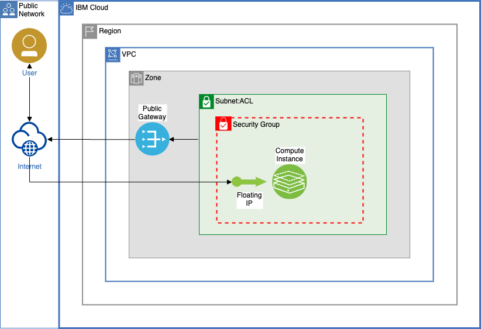

# Learn Terraform for Wazi aaS basics - by NLopez 
This repo has 2 folders to help you learn how to create a new Wazi aaS instance using terraform script and your IBM Cloud account. 

The projec folders are:
``` learn-terra-basic ``` gives a highlevel overview of the scripting lanugae using local resources.  
``` learn-terra-wazi ``` is a more advanced example that creates a wazi instance using the 'special' beta release and a prototype IaC application setup.  


## The basics folder 
This project folder has a few sample *.tf files.  They  provide basic getting started tips on how to use HashiCorp's Terraform HCL scripting language. For more on getting started see https://learn.hashicorp.com/collections/terraform/cli


### install terraform on windows
- Install terra for windows https://releases.hashicorp.com/terraform/1.2.4/  (or any supported OS)
- Add the executable to the path using (Windows) ``` SETX PATH ...```
- A nice to have is the vsCode extension https://marketplace.visualstudio.com/items?itemName=HashiCorp.terraformthe 

>TIP: In vsCode, open a terminal to run terraform cli by right clicking the project folder and selecting "Open in Intergrated terminal" where you can enter enter 'terraform init' etc...

## After the install
Use the basics project or create your own with any name to build your .tf scripts. From the cli, run terraform cmds like  -  'terraform init', plan, apply, show, destroy  

>TIP: To skip the interactive prompt "enter yes" during an 'apply', run 'terraform apply -auto-approve'

Terra tracks diff's between applys to keep resources up to date.

To start learning, open the sample main.tf script and follow the notes. 

For more on IBM's Terraform plugin, see the VPC infrastructure topic in:
   IBM Cloud plugin is https://registry.terraform.io/providers/IBM-Cloud/ibm/latest/docs


## The Advanced project folder  "Create a Wazi aaS instance for DBB Builds"
The main.tf terraform script is derived from [IBM Sample terraform repo](https://cloud.ibm.com/docs/ibm-cloud-provider-for-terraform?topic=ibm-cloud-provider-for-terraform-sample_vpc_config)

This sample uses a pre-defined local ssh-key and an IBM Cloud account apikey with access to create a Wazi aaS VSI. 

In windows, run the ssh-keygen cmd and add your public key to your clound acct. Then access your clound acct apikey and add it as a local environment varaiable using SETX IC_API_Key=<apikey> (or add the key in a script - but thats not recommended)


Run terraform CLIs found in this folder using the standard flow:
   - **init**
   - **plan**
   - **apply**  
   - and eventualy **destroy**
   - **show** to view your current state 

>tweaks to the IBM sample
+ Due to permission restrictions in the demo Cloud acct, a few extra vars were added  like; resource group, image name and a pre-existing ssh key plus a few more.  YOu'll need to add your sshkey to your Cloud acct.
+ Extended most resource blocks to pass the resource group id
+ The IBM sample does not adhere to normal terraform file naming conventions. For example it calls the main script vpc.tf.  I changed it to main.tf.  But terraform really doesnt care what you call the file as long as it ends in .tf 

[This is a link to IBM terraform plugin Doc](https://cloud.ibm.com/docs/ibm-cloud-provider-for-terraform?topic=ibm-cloud-provider-for-terraform-provider-template#code-snippets)

## Tech Notes - and Building an Application Runtime 
The experimental Wazi image (as of June 2022) is configured with Git, DBB, RSE and zoSMF. 

After the IPL you can setup IDz, Zowe and 3270 access.  SSH into USS is avialable after the IPL and uses the local SSH key that was 'applied' during the VSI creation. 

### Application Runtime Initialization 
This folder includes a sample script to demostrate how to build a working application runtime environment after the first IPL. It uses standard IBM utilities to 'copy' development and production runtime libraries like joblibs, CICS RPL libs, CNTL, JCL...

It then transports the copy to the new zOS instance and restores the libraries.  
It also capture a sample CICS application's defintions.  

This process requires some planning and setup before starting your new instance. 
 - Review App-IaC/APPDUMP.jcl ion this folder.  Copy it to a PDS on your Dev Lpar and follow the comments in the JCL.  This job will capture application libraries and production libraries as 2 seperate transportable files. It also extract CICS defintion by GROUP. If you not testing a CICS application, just remove the step in the JCL. 

 - Review the App-IaC/CICSTS56.JCL.  This jcl is a copy of the Wazi aaS zOS JCL (CICS v56 STC) as of June 2022.  If you are testing a CICS application then, in addtion to extracting CICS defintions, you will need to add your applicaitons RPL libs that were included in the APPDUMP job. 
 - 


in 'App-IaC/postinit' to help automate the e advanced folder has a helping windows batch script to help to finalize several one-time setup steps. 

### User ID, IP & Ports

The terra script creates a floating IP which is used to access the system after the IPL. You can view the IPL state from your Cloud account by selecting the new VSI 'action' menu item 'view serial term'.  You can also re-ipl from that menu. 

**User ID**
The default is RACGH user is IBMUSER and password is SYS1. If you have trouble accessing the system try a re-IPL.  

**Ports**
- **3270=992** you need a 3270 emulator that accepts certs on port 992 using TLS and MS-CAPI (windows). PCOM and IDz Host term dont seem to work reliablity - I use Vista.   The postinit.bat script installs the cert from z/OS to your local windows registry (review windows MMC certificate snap-on for more advanced cert related features). 
- **RSE=8137**
- **RSEAPI=8195**
- **zOSMF=10443** 

**Example Wazi Topology**

